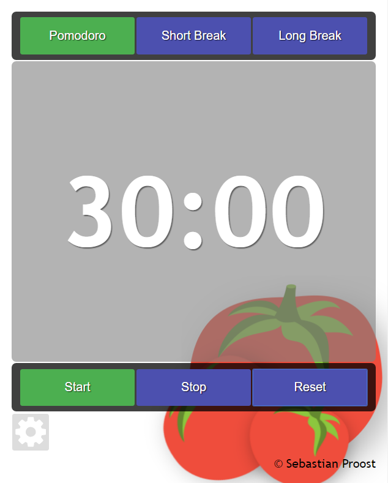

# React-Pomodoro
Pure reactjs project, runs a Pomodoro-Timer.

[DEMO](https://sebastian.proost.science/React-Pomodoro/)

## Deploy using Docker

You can get React-Pomodoro in a container bundled with nginx for easy deployment

    docker pull sepro/react-pomodoro
    
Start the webserver using the following command

    docker run -p 80:80 -d sepro/react-pomodoro

The website is now available on *localhost*.

## For developers
Clone the repository and run npm install to pull in all the packages

    npm install
    

To package/build the code (will end up in ./dist/client.min.js): 

    webpack -p
    

Push subtree to gh-pages, a quick way to set up a demo

    git subtree push --prefix dist origin gh-pages

## Acknowledgements

I'm a coder not an artist, so I've used publically available images and sounds labeled free for reuse with modification from:

  * [www.publicdomainpictures.net](http://www.publicdomainpictures.net/pictures/140000/velka/baby-plum-tomatoes.jpg)
  * [Emojine](https://commons.wikimedia.org/wiki/File:Emojione_1F345.svg)
  * [Freesound](https://www.freesound.org/people/HonorHunter/sounds/271666/)
